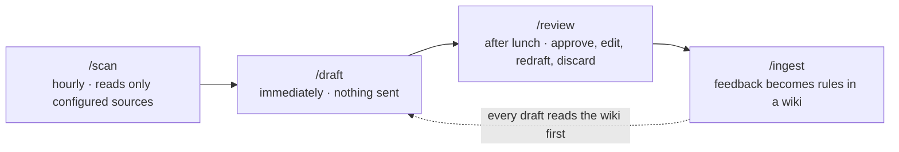

# elves

**A small harness for knowledge work. It runs the always-on loop with whatever coding agent you already have: drafts work before you ask, on your laptop, with scheduled jobs, a database you own, and a second-brain wiki you can read. Your only job is review.**

https://github.com/user-attachments/assets/c30cd69e-da04-4e5c-be8c-6200f52a0d2c

*Two-minute explainer. Downloads: [narrated](media/elves-explainer.mp4) · [silent, captions on screen](media/elves-explainer-silent.mp4) · [script](media/script.md)*

> **The whole product is one file: [`elves-idea-file.md`](elves-idea-file.md).** About 200 lines. Hand it to your coding agent and say *"Read this and build it. Start with `/setup`."* Then customize it however you like.

## Why share it now

[Muse](https://about.fb.com/news/2026/09/introducing-muse-personal-ai-agent/), [Grok Bot](https://x.ai/bot), and [dots](https://openai.com/index/introducing-dots/) all shipped this month selling the same loop: an always-on agent that watches your work, drafts while you're away, brings you finished work, and learns from your feedback. All three run on a cloud computer with broad access to your accounts, on a paid plan.

**elves** is that loop, free, local, and controllable, at a scale one person can run and read. I have been running it on my own laptop since before they launched. It watches whatever places requests reach you that your coding agent can connect to (email, chat, calendar, tickets, documents), chosen in a short setup interview, and leaves out the parts I don't want running unattended: it doesn't drive a browser, sign into websites, or make calls.

- **Free.** One MIT-licensed idea file, about 200 lines. No subscription, no cloud computer. Hand it to Claude Code, Codex, Cursor, or whatever coding agent your company already allows, and it builds it. Then customize it however you like.
- **Local.** A sqlite file and a folder of markdown on your laptop. launchd or cron runs `/scan` hourly, `/ingest` nightly, and `/lint` weekly. It is always on while the laptop is awake, which turns out to be enough.
- **A database you own.** Every task, its status, and every piece of feedback you give is a row you can query, back up, or delete.
- **Controllable.** It reads only the sources named in one `config.yaml`. Nothing is sent, shared, or changed outside the folder; every write tool a connector exposes is denied in the harness, not just discouraged in the prompt.
- **Any coding agent, including the one you already have at work.** You may not be able to use Muse, Grok Bot, or dots on a work machine, and you do not need to.
- **A second brain you can read.** Everything it learns lands in a markdown wiki: a page per person, project, and output type, plus your style rules, an index, and a log. Every rule cites the feedback it came from. Open the folder in Obsidian and you can see all of it, and change any of it.

## The tale

The shoemaker goes to bed. In the morning, the shoes are finished. All he does is look them over.

Imagine coming back from lunch, a meeting, or a stretch of deep work to find every important ask that came in while you were out already drafted and waiting for your review. No triaging messages, no kicking off agents and babysitting them.

That is the whole design. elves is not an agent; it is the harness around one. It watches for requests, decides what deserves a draft, has your coding agent produce it without being told to start, and turns your review into rules so the next draft is better. The executive's only job is `/review`.

## How it works



- **`/scan`** runs hourly from a scheduled job. It pulls new items from the inbound sources in `config.yaml` (mail threads, chat messages, calendar events, tickets, whatever you chose), decides what needs action, and triages each thread: `draft`, `quick_reply`, `delegate`, `clarify`, or `ignore`. Ignored threads never become tasks. A meeting with other attendees is a request for prep; your own solo reminders become to-dos.
- **`/draft`** runs the moment a scan finds work. Each task gets a subagent that reads the wiki (style, the requester's page, the project's page, the playbook for that output type, and prior feedback) before writing anything, and writes its output to `tasks/<id>/`. No permission prompt. Nothing is sent.
- **`/review`** is the after-lunch view. Every item opens with the same line: *Action taken: read X, drafted Y at `tasks/<id>/…`, nothing sent.* You approve, edit, redraft, or discard. Each reaction is logged as a feedback row.
- **`/ingest`** turns feedback into rules. *"Too long, Sam just wants the number"* becomes one line on `wiki/people/sam.md`: *Prefers the headline number first; skip methodology unless asked.* Every rule cites the raw transcript it came from, and a newer rule rewrites an older one instead of piling up beside it.
- **`/lint`** runs weekly and flags stale pages, contradictions, and playbooks whose drafts keep getting low ratings.
- **`/todo`** is your own list: approved items you said you'd handle, drafts waiting for review, and what is being drafted right now.

State lives in three places you can open directly: `tasks.db` (sqlite: tasks, feedback, runs, and the scan's dedupe memory), `tasks/<id>/` (the drafts), and `wiki/` (the rules). There is nothing else.

## The wiki is a second brain

The products above all say their agent "learns your preferences." Here you can read what was learned. The wiki is plain markdown with `[[wiki-links]]`, so it opens as an Obsidian vault, and it is organized the way a second brain is: by the people you work with, the projects you are on, and the kinds of things you produce.

```
wiki/
  index.md              every page, one line each
  log.md                one line per scan, draft, ingest, and lint
  style.md              your voice: tone, length, sign-off
  people/<name>.md      what each requester wants, distilled from your feedback
  projects/<name>.md    context, history, constraints, and which sources apply
  playbooks/<type>.md   how to produce a reply, a status update, a meeting prep
  lint/<date>.md        weekly findings
  raw/                  feedback transcripts, append-only, never edited
```

Three rules keep it honest. Feedback is distilled into a rule, never pasted in as a quote. Every rule cites the raw transcript it came from, so you can trace it. A newer rule rewrites an older one instead of accumulating beside it, so a page reads as what is true now. `/lint` flags the pages that have gone stale, contradict each other, or keep producing drafts you rate low. The result is a knowledge base that grows one review at a time and that you can open, search, and correct by hand whenever you like.

## Run it

The whole product is one idea file, about 200 lines, that you implement and customize with your own coding agent: [`elves-idea-file.md`](elves-idea-file.md). It covers scope, the setup interview, the database schema, each command, and the things that bit on the first day of running it unattended.

1. Clone this repo, or just copy the file into an empty folder.
2. Open the folder in a coding agent that can reach your tools (Claude Code, Codex, Cursor, or whatever you use with MCP connectors).
3. Tell it: *"Read `elves-idea-file.md` and build it. Start with `/setup`."*
4. Answer the setup interview: which inboxes and calendars to watch, which folders it may read while drafting, who your regulars are.
5. Schedule `/scan` hourly (launchd, cron, or a systemd timer) with an explicit tool allowlist and a denylist for every write tool.
6. After lunch, run `/review`.

The seed is the product. The code your agent writes from it is yours to keep iterating on, and the seed is meant to absorb any lesson that would help someone else running the same loop.

## What good looks like after a month

- `/review` takes fifteen minutes and most items are approved unchanged. `/todo` takes fifteen seconds.
- The queue is only ever things that matter. Nobody scrolls past receipts to find the work.
- Meetings arrive with a one-page brief the day before, and your own reminders show up in `/todo` without anyone typing them in.
- The wiki has a page for every regular requester and active project, and the rules on those pages are things you would recognize as true.
- Average feedback rating is rising. If it isn't, `/lint` says why.

## What's in this repo

| Path | What it is |
|---|---|
| [`elves-idea-file.md`](elves-idea-file.md) | The seed. The entire design, meant to be handed to a coding agent. |
| [`media/`](media/) | The explainer video (narrated and silent), its captions, script, and poster frame. |

The running instance lives in a separate private folder, because `tasks/`, `tasks.db`, and `wiki/raw/` hold real messages, names, and verbatim feedback. Keep yours private too.

## Credits

The `/ingest` step is modeled on Andrej Karpathy's LLM wiki idea: the wiki is compiled knowledge, the agent is the compiler, and raw inputs are never edited. Built with Claude Code. A personal project by [Matthew Corritore](https://github.com/myaa2913).

## License

[MIT](LICENSE)
