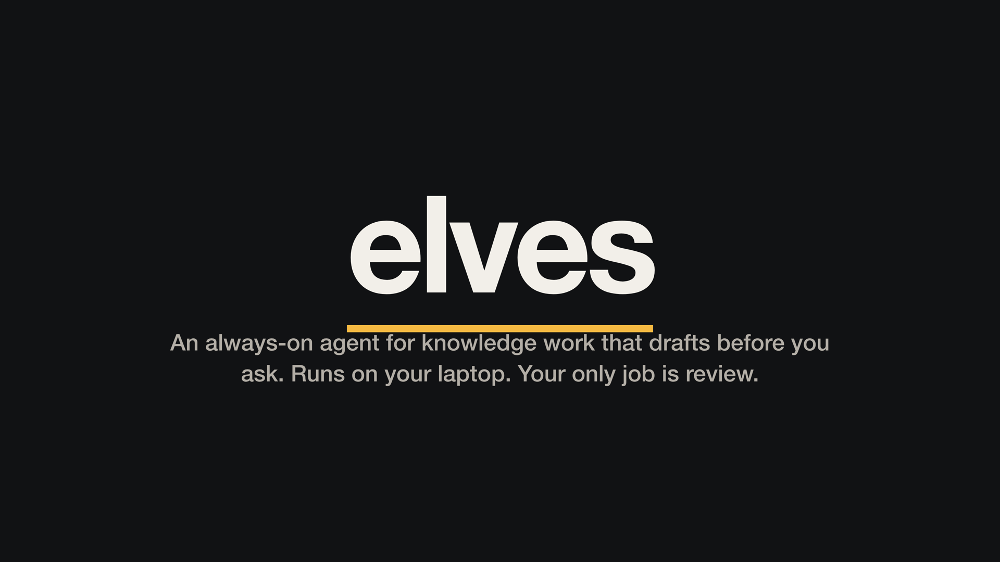
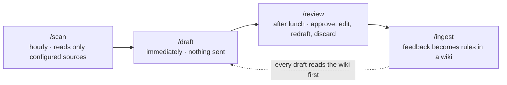

# elves

**An always-on agent for knowledge work that drafts before you ask. Runs on your laptop. Your only job is review.**

*Two-minute explainer: [narrated](media/elves-explainer.mp4) · [silent, captions on screen](media/elves-explainer-silent.mp4) · [script](media/script.md)*

## The week of the always-on agent

Meta shipped [Muse](https://about.fb.com/news/2026/09/introducing-muse-personal-ai-agent/) earlier this month: a personal agent on a dedicated cloud VM that keeps working after you close the app and comes back when it needs your approval. OpenAI answered on September 29 with [dots](https://openai.com/index/introducing-dots/): always-on agents inside ChatGPT, each with its own cloud computer, working toward your goals around the clock, learning from your feedback, and connecting to thousands of apps. OpenAI's own description of the goal is work done the way you would do it, "sometimes before you even think to ask."

That is the right goal. Both products also share three design choices: the agent runs on a computer in someone else's cloud, it is connected to as many of your apps as you will allow, and it decides case by case when to act on its own and when to ask.

**elves** is the same promise, scoped to the part of the day that actually disappears for knowledge workers: the inbox and the calendar. It was built on a laptop with a coding agent from the single markdown file in this repo, and it makes three different bets.

1. **Local.** Everything runs on your machine with the coding agent you already use. No cloud computer, no new account, no data leaving the laptop.
2. **Scoped.** It reads only the sources named in one `config.yaml`. Anything not named is never read. A wiki page can narrow that scope; nothing can widen it.
3. **Nothing ships.** There is no "act on its own" mode to configure. It drafts; you send. Every write tool a connector exposes (send, reply, forward, create event, delete) is denied in the harness, not just discouraged in the prompt.

## The tale

The shoemaker goes to bed. In the morning, the shoes are finished. All he does is look them over.

That is the whole design. The agent fields requests, decides what deserves a draft, produces the draft without being told to start, and learns from your review so the next one is better. The executive's only job is `/review`.

## How it works

- **`/scan`** runs hourly. It pulls new messages and upcoming events from the inbound sources in `config.yaml`, decides what needs action, and triages each thread: `draft`, `quick_reply`, `delegate`, `clarify`, or `ignore`. Ignored threads never become tasks. A meeting with other attendees is a request for prep; your own solo reminders become to-dos.
- **`/draft`** runs the moment a scan finds work. Each task gets a subagent that reads the wiki (style, the requester's page, the project's page, the playbook for that output type, and prior feedback) before writing anything, and writes its output to `tasks/<id>/`. No permission prompt. Nothing is sent.
- **`/review`** is the after-lunch view. Every item opens with the same line: *Action taken: read X, drafted Y at `tasks/<id>/…`, nothing sent.* You approve, edit, redraft, or discard. Each reaction is logged as feedback.
- **`/ingest`** turns feedback into rules. *"Too long, Hamin just wants the number"* becomes one line on `wiki/people/hamin.md`: *Prefers the headline number first; skip methodology unless asked.* Every rule cites the raw transcript it came from, and a newer rule rewrites an older one instead of piling up beside it. The wiki is plain markdown you can read and edit.
- **`/lint`** runs weekly and flags stale pages, contradictions, and playbooks whose drafts keep getting low ratings.
- **`/todo`** is your own list: approved items you said you'd handle, drafts waiting for review, and what the agent is working on right now.

## Run it

The design is one markdown file, about 200 lines: [`automate-agent-task-execution.md`](automate-agent-task-execution.md). It covers scope, the setup interview, the database schema, each command, and the things that bit on the first day of running it unattended.

1. Clone this repo, or just copy the file into an empty folder.
2. Open the folder in a coding agent that can reach your tools (Claude Code, Codex, Cursor, or whatever you use with MCP connectors).
3. Tell it: *"Read `automate-agent-task-execution.md` and build it. Start with `/setup`."*
4. Answer the setup interview: which inboxes and calendars to watch, which folders it may read while drafting, who your regulars are.
5. Schedule `/scan` hourly (launchd, cron, or a systemd timer) with an explicit tool allowlist and a denylist for every write tool.
6. After lunch, run `/review`.

The seed is the product. The code your agent writes from it is yours to keep iterating on, and the seed is meant to absorb any lesson that would help someone else running the same loop.

## What good looks like after a month

- `/review` takes fifteen minutes and most items are approved unchanged. `/todo` takes fifteen seconds.
- The queue is only ever things that matter. Nobody scrolls past receipts to find the work.
- Meetings arrive with a one-page brief the day before, and your own reminders show up in `/todo` without anyone typing them in.
- The wiki has a page for every regular requester and active project, and the rules on those pages are things you would recognize as true.
- Average feedback rating is rising. If it isn't, `/lint` says why.

## What's in this repo

| Path | What it is |
|---|---|
| [`automate-agent-task-execution.md`](automate-agent-task-execution.md) | The seed. The entire design, meant to be handed to a coding agent. |
| [`media/`](media/) | The explainer video (narrated and silent), its captions, script, and poster frame. |

The running instance lives in a separate private folder, because `tasks/`, `tasks.db`, and `wiki/raw/` hold real messages, names, and verbatim feedback. Keep yours private too.

## Credits

The `/ingest` step is modeled on Andrej Karpathy's LLM wiki idea: the wiki is compiled knowledge, the agent is the compiler, and raw inputs are never edited. Built with Claude Code. A personal project by [Matthew Corritore](https://github.com/myaa2913), running on his laptop since September 2026.

## License

[MIT](LICENSE)
